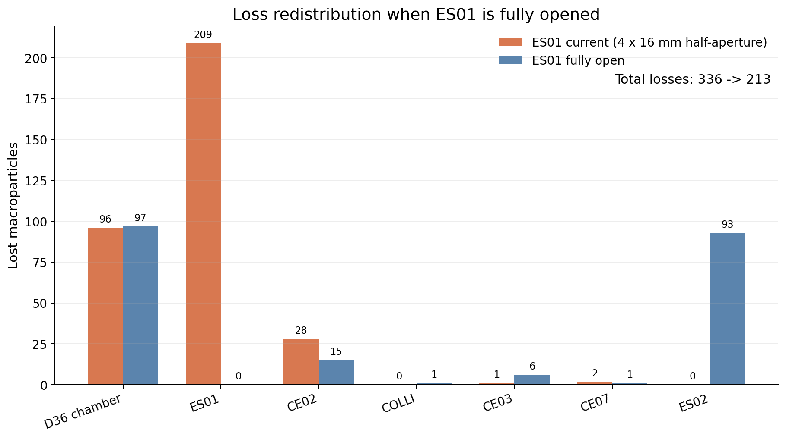
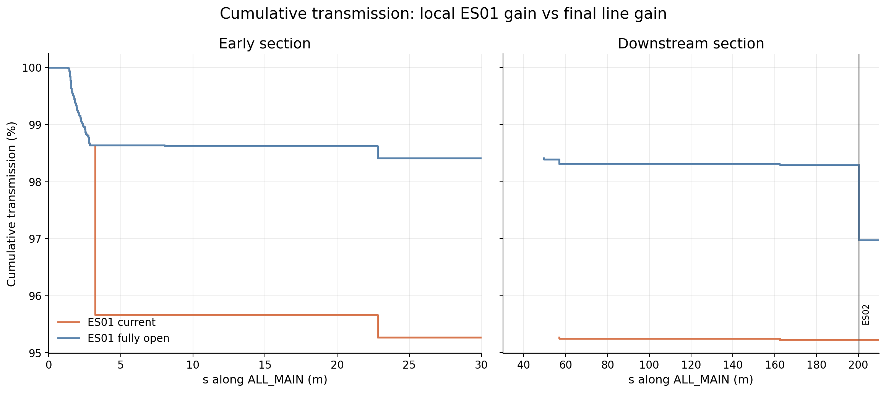
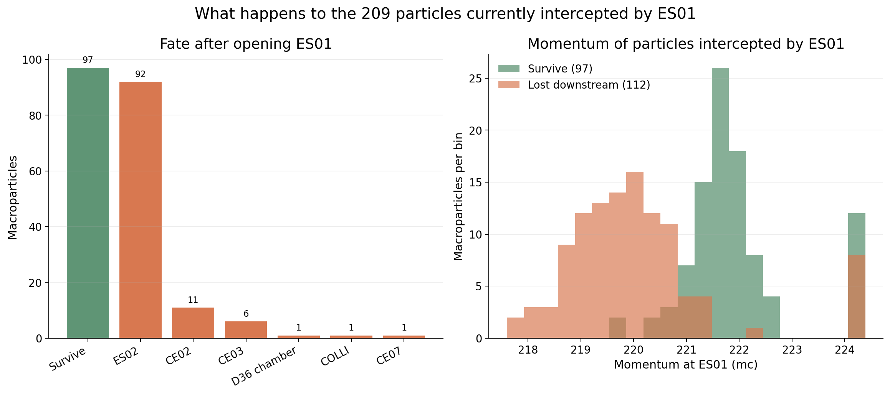

# ES01 当前开度与完全打开束损对比

## 结论摘要

使用当前工作区的 `lattice_ini.lte` 和 `HALF_pre_1A_main.dat` 中全部 7,037 个宏粒子，对 ES01 的当前设置与完全打开状态进行了离线 tracking 对比。

- ES01 当前净开口为水平 8 mm × 垂直 32 mm（`X_MAX=4 mm`、`Y_MAX=16 mm`）。完全打开仅在对照算例中通过 `X_MAX=Y_MAX=0` 实现，没有修改源 lattice。
- 当前开度下共损失 336 个粒子，末端通过 6,701 个，通过率为 95.2252%。
- 完全打开后共损失 213 个粒子，末端通过 6,824 个，通过率为 96.9731%；比当前设置增加 123 个通过粒子，通过率提高 1.7479 个百分点，总损失数减少 36.61%。
- 当前 ES01 截获 209 个粒子。打开后，其中 97 个到达束线末端，112 个仍在下游损失，主要转移到 ES02（92 个）。因此打开 ES01 会明显降低总损失，但也会把主要局部损失负荷转移到下游 ES02。
- 按粒子 ID 核对，完全打开组损失的 213 个粒子全部属于当前设置下已经损失的粒子；本算例没有出现“当前能通过、打开 ES01 后反而最终损失”的粒子。
- ES01 的限制来自水平方向：209 个截获粒子的垂直位置均在 ±2.43 mm 内，远小于 ±16 mm 垂直半孔径；其中 189 个撞击 `+x` 侧，20 个撞击 `-x` 侧。

## 当前晶格中的能量狭缝

本报告以用户最新更新的 `src/virtual_machine/half_elegant/elegant/lattice_ini.lte` 为准：

| 元件 | 当前定义 | 净开口 | 在 `ALL_MAIN` 中的位置 |
|---|---|---:|---|
| ES01 | `RCOL, X_MAX=4e-3, Y_MAX=16e-3` | 8 mm × 32 mm | `s=3.22500 m` |
| ES02 | `RCOL, X_MAX=6e-3, Y_MAX=16e-3` | 12 mm × 32 mm | `s=200.23342 m` |
| ES03、ES04 | 已注释 | — | 不在当前 `ALL_MAIN` 中 |

这里的 `X_MAX`、`Y_MAX` 是半孔径。对照组只把 ES01 的两个半孔径设为 0；在 elegant 的 `RCOL` 定义中，这表示对应方向不施加限制。ES02 和其余全部元件在两组中保持一致。

## Tracking 设置

### 输入粒子

两组均直接读取 `src/virtual_machine/half_elegant/elegant/HALF_pre_1A_main.dat`，不抽样、不重新生成粒子。

| 参数 | 数值 |
|---|---:|
| 粒子数 | 7,037 |
| 水平 RMS 尺寸 | 1.562 mm |
| 垂直 RMS 尺寸 | 1.575 mm |
| 水平坐标范围 | -5.328～5.202 mm |
| 垂直坐标范围 | -5.014～5.031 mm |
| 平均动量 | 223.642 mc |
| 动量标准差 | 1.380 mc |
| 动量范围 | 207.201～224.409 mc |

### 仿真条件

| 设置 | 数值 |
|---|---|
| elegant | 2022.1.0，SVN revision 28583M |
| beamline | `ALL_MAIN` |
| `p_central` | 223.4028 mc |
| `input_type` | `elegant` |
| `sample_interval` | 1 |
| `center_arrival_time` | 1 |
| RFCW 尾场 | 保留当前 lattice 设置 |
| 随机种子 | 9876543210 |
| 磁铁误差、校正铁踢角 | 0 |

两组除 ES01 开度外完全相同。仿真为离线 VM/elegant 计算，没有连接真实机器或修改 IOC。

## 总传输与损失

| 指标 | ES01 当前开度 | ES01 完全打开 | 打开后的变化 |
|---|---:|---:|---:|
| 输入粒子 | 7,037 | 7,037 | 0 |
| 末端通过粒子 | 6,701 | 6,824 | **+123** |
| 总损失粒子 | 336 | 213 | **-123** |
| 末端通过率 | 95.2252% | 96.9731% | **+1.7479 个百分点** |
| 总损失率 | 4.7748% | 3.0269% | -1.7479 个百分点 |

完全打开使损失数相对当前设置减少 `123/336=36.61%`。下图分别放大前段 ES01 区域和下游区域，展示累计通过率随纵向位置的变化。

## 损失位置重新分布

| 损失位置 | 纵向位置 | 当前开度 | 完全打开 | 变化 |
|---|---:|---:|---:|---:|
| 直径 36 mm 真空室 | 分布损失 | 96 | 97 | +1 |
| ES01 | 3.22500 m | 209 | 0 | -209 |
| CE02 | 22.79718 m | 28 | 15 | -13 |
| COLLI | 49.66654 m | 0 | 1 | +1 |
| CE03 | 56.86372 m | 1 | 6 | +5 |
| CE07 | 162.42142 m | 2 | 1 | -1 |
| ES02 | 200.23342 m | 0 | 93 | **+93** |
| **合计** | — | **336** | **213** | **-123** |

`CE04`、`CE05`、`CE06` 在两组中均未观察到损失。完全打开 ES01 后，ES02 从无损失变为全线最大的单点损失位置，承担 93 个粒子，占打开组全部损失的 43.66%。这说明 ES01 当前设置不仅降低末端传输，也在上游提前清除了部分会撞击下游能量狭缝和小孔径元件的粒子。

## ES01 截获粒子的后续去向

当前开度下 ES01 截获 209 个粒子，占输入束流的 2.9700%。把同一批粒子放入完全打开算例后，其去向如下：

| 完全打开后的去向 | 粒子数 | 占 ES01 原截获粒子 |
|---|---:|---:|
| 到达束线末端 | 97 | 46.41% |
| ES02 损失 | 92 | 44.02% |
| CE02 损失 | 11 | 5.26% |
| CE03 损失 | 6 | 2.87% |
| 直径 36 mm 真空室 | 1 | 0.48% |
| COLLI 损失 | 1 | 0.48% |
| CE07 损失 | 1 | 0.48% |
| **合计** | **209** | **100%** |

打开后有 97/209（46.41%）原本在 ES01 损失的粒子真正转化为末端通过粒子；其余 112/209（53.59%）只是改变了损失位置。最终净增加的通过粒子为 123 个，多出的 26 个来自尾场和粒子群组成改变后其他损失点的重新分配。

## ES01 的能量选择特征

ES01 截获粒子的平均动量为 220.931 mc，低于输入束流平均值 223.642 mc；其动量范围为 217.600～224.387 mc。

| ES01 当前截获粒子的分类 | 粒子数 | 平均动量 | 动量范围 |
|---|---:|---:|---:|
| 打开后到达末端 | 97 | 221.922 mc | 219.627～224.387 mc |
| 打开后仍在下游损失 | 112 | 220.072 mc | 217.600～224.359 mc |

下游仍损失组的平均动量比成功通过组低约 1.85 mc。结合 189 个粒子撞击 `+x` 侧、仅 20 个撞击 `-x` 侧，可以看出当前色散和轨道条件下，ES01 主要截除偏向一侧的低动量尾部，而不是由垂直开口限束。

## 束线末端束流参数

以下参数来自两组 `.fin` 文件中的末端统计：

| 参数 | 当前开度 | 完全打开 | 变化 |
|---|---:|---:|---:|
| 平均动能 | 2,197.965 MeV | 2,197.829 MeV | -0.136 MeV |
| 水平 RMS 尺寸 | 0.1822 mm | 0.1716 mm | -0.0106 mm |
| 垂直 RMS 尺寸 | 0.1709 mm | 0.1661 mm | -0.0048 mm |
| RMS 相对动量展宽 `Sdelta` | 0.001235 | 0.001352 | **+9.41%** |
| 归一化水平发射度 | 30.991 μm | 31.212 μm | +0.22 μm |
| 归一化垂直发射度 | 37.443 μm | 36.883 μm | -0.56 μm |

ES01 完全打开提高了传输，但保留了更多低动量尾部，使末端平均能量略降、相对动量展宽增大。末端 RMS 尺寸和发射度变化较小，不应单独据此判断运行状态优劣。

## 工程判断

1. 如果目标是最大化当前束流样本的末端传输，完全打开 ES01 在本算例中更有利：通过率提高 1.7479 个百分点，而且没有让当前可通过粒子变成最终损失粒子。
2. 如果目标是限制动量尾部并把损失控制在设计的上游位置，当前 ES01 设置具有明确作用：它截获 209 个粒子，并避免 ES02 承担 93 个粒子的集中损失。
3. 完全打开不是“消除损失”，而是把 ES01 的 209 个局部损失分解为 97 个新增通过粒子和 112 个下游损失。评估运行方案时应同时比较 ES01 与 ES02 的允许损失功率、屏蔽、活化、热负荷和真空承受能力。
4. 本次宏粒子没有携带报告中可直接换算的绝对束流功率信息，因此这里只报告粒子数和比例；不能把 93 个宏粒子直接解释为真实瓦数。

## 适用范围与限制

- 结论只针对当前 `ALL_MAIN` 光学、当前 RFCW 尾场模型和 `HALF_pre_1A_main.dat` 这一束流样本。
- 未加入磁铁安装误差、轨道校正残差、束流抖动和 ES01 机械重复性误差。
- 两组都保留集体尾场。改变 ES01 截获数量会改变下游参与尾场作用的粒子群，因此损失位置的变化不必逐粒子一一对应。
- “完全打开”是通过仿真中取消 ES01 横、纵孔径限制实现的理想对照，不代表真实机构一定能够达到无限开口。

若用于运行设定选择，建议下一步在 ES01 水平全开度 8、10、12、16 mm 及完全打开之间做扫描，并同步记录 ES01、CE02、ES02 的损失分配和末端 `Sdelta`，以得到传输率与局部损失/能散之间的折中曲线。
