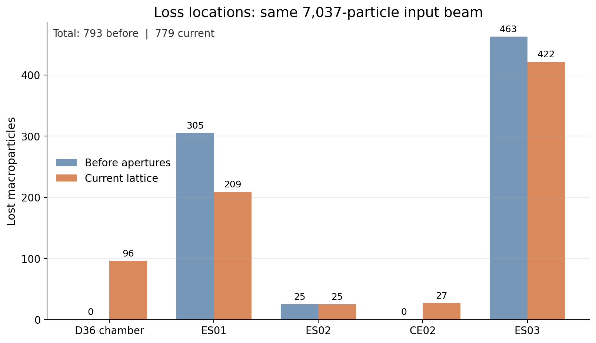
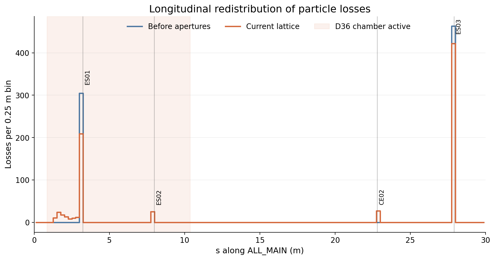
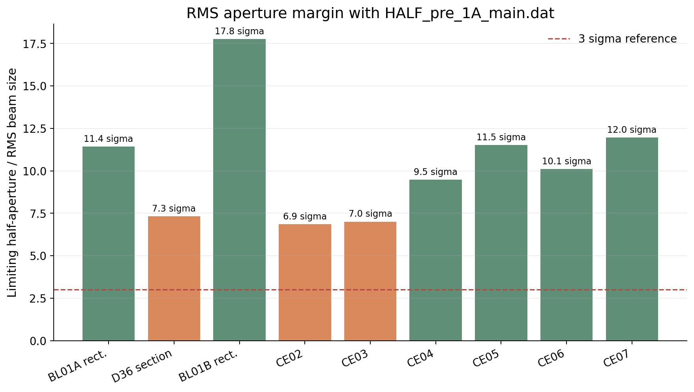

# HALF 直线加速器新增孔径 tracking 分析

## 结论摘要

使用 `HALF_pre_1A_main.dat` 中全部 7,037 个粒子，对新增真空室和 `CE02`–`CE07` 进行修改前/后对照 tracking。结果表明：

- 总损失没有增加：修改前损失 793 个，当前模型损失 779 个，通过率由 88.7310% 变为 88.9299%。
- 新孔径改变了部分损失位置：96 个粒子提前撞在 BL01A–BL01B 之间的直径 36 mm 真空室，27 个粒子提前损失于 `CE02`。
- 按粒子 ID 核对，这 123 个粒子在修改前也会损失，分别损失于 `ES01` 和 `ES03`，因此它们不是新增的最终损失粒子。
- BL01A、BL01B 内的 56 mm × 36 mm 矩形真空室未产生损失；`CE03`–`CE07` 也未产生损失。
- 工程上不能把总损失减少 14 个理解为孔径改善。需要重点关注损失从既有限束器转移到直径 36 mm 真空室和 `CE02` 后的局部热负荷、辐射、活化与真空影响。

## 新增孔径模型

孔径定义位于 `src/virtual_machine/half_elegant/elegant/lattice_ini.lte`。

| 区域或元件 | elegant 模型 | 净孔径 | 作用方式 |
|---|---|---:|---|
| BL01A | `MAXAMP`, rectangular | 56 mm × 36 mm | 在 `CSBEND` 内部持续检查 |
| BL01A–BL01B 之间 | `MAXAMP`, elliptical | 直径 36 mm | 从 BL01A 出口持续到 BL01B 入口 |
| BL01B | `MAXAMP`, rectangular | 56 mm × 36 mm | 在 `CSBEND` 内部持续检查 |
| CE02–CE07 | 零长度 `ECOL` | 直径 12 mm | 在各元件安装位置进行一次横向截面检查 |

elegant 使用半孔径，因此模型参数分别为：

- BL01A/BL01B：`X_MAX=28e-3`、`Y_MAX=18e-3`、`ELLIPTICAL=0`；
- 中间圆形真空室：`X_MAX=Y_MAX=18e-3`、`ELLIPTICAL=1`；
- CE02–CE07：`X_MAX=Y_MAX=6e-3`。

## Tracking 设置

### 输入粒子

粒子直接读取自 `src/virtual_machine/half_elegant/elegant/HALF_pre_1A_main.dat`。该文件是 elegant ASCII SDDS 文件，含 `x, xp, y, yp, t, p` 六列，不需要再次转换。

| 参数 | 数值 |
|---|---:|
| 粒子数 | 7,037 |
| 水平 RMS 尺寸 | 1.562 mm |
| 垂直 RMS 尺寸 | 1.575 mm |
| 水平坐标范围 | -5.328～5.202 mm |
| 垂直坐标范围 | -5.014～5.031 mm |
| 平均动量 | 223.642 mc |
| 动量标准差 | 1.381 mc |

### 仿真条件

| 设置 | 数值 |
|---|---|
| elegant | 2022.1.0，SVN revision 28583M |
| beamline | `ALL_MAIN` |
| `p_central` | 223.4028 mc |
| `input_type` | `elegant` |
| `sample_interval` | 1，使用全部粒子 |
| `center_arrival_time` | 1 |
| RFCW 尾场 | 保留当前 lattice 设置 |
| 磁铁误差 | 0 |
| 校正铁踢角 | 0 |

修改前基准采用 Git revision `c4654b769d59ecd48fc84700c51c728ed111490e` 中的 `lattice_ini.lte`；当前组采用加入新孔径后的工作区 lattice。两组使用完全相同的输入粒子和运行参数。

## 损失结果

| 损失位置 | 修改前 | 当前模型 | 当前占输入粒子比例 |
|---|---:|---:|---:|
| 直径 36 mm 真空室 | 0 | 96 | 1.3642% |
| ES01 | 305 | 209 | 2.9700% |
| ES02 | 25 | 25 | 0.3553% |
| CE02 | 0 | 27 | 0.3837% |
| ES03 | 463 | 422 | 5.9969% |
| CE03–CE07 | 0 | 0 | 0 |
| **总损失** | **793** | **779** | **11.0701%** |
| **通过粒子** | **6,244** | **6,258** | **88.9299%** |

当前模型的损失集中在前 30 m。下图中浅色区域为直径 36 mm 真空室生效范围；该真空室把一部分原本集中在 `ES01` 的损失提前分散到上游漂移段。

### 直径 36 mm 真空室

96 个撞壁粒子的纵向位置为 `s=1.351～2.867 m`：

| 所在段 | 损失数 |
|---|---:|
| DHOTGUN0 | 34 |
| DHOTGUN1 | 62 |

这些粒子的撞击半径为 18 mm，与圆形真空室半径一致。按粒子 ID 追踪，96 个粒子在修改前全部于 `ES01` 损失。

### CE02–CE07

- `CE02` 损失 27 个粒子；这些粒子在修改前全部于下游 `ES03` 损失。
- `CE03`、`CE04`、`CE05`、`CE06`、`CE07` 均未观察到粒子损失。

## 粒子 ID 对照

| 分类 | 粒子数 | 说明 |
|---|---:|---|
| 两组都损失 | 778 | 其中 123 个损失位置提前 |
| ES01 → D36 真空室 | 96 | 最终仍损失，但撞击位置改变 |
| ES03 → CE02 | 27 | 最终仍损失，但撞击位置改变 |
| 仅修改前损失 | 15 | 当前模型中通过 |
| 仅当前模型损失 | 1 | 当前模型中损失于 ES03 |

当前 lattice 的 RFCW 模型包含集体尾场。提前移除 123 个粒子会改变后续束团分布和尾场，因此出现 15 个原损失粒子通过、另有 1 个粒子新损失的重新分配，净结果为总损失减少 14 个。这一差异不能解释成新孔径本身提高了束流品质。

## RMS 孔径余量

下图给出当前 tracking 中限制方向的半孔径与 RMS 束流尺寸之比。D36 段使用 `s=0.85～10.35 m` 范围内最大的 RMS 尺寸；其他位置使用对应元件处的 tracked RMS 尺寸。

| 位置 | RMS 孔径余量 |
|---|---:|
| BL01A 矩形室 | 11.4σ |
| D36 圆形室 | 7.3σ |
| BL01B 矩形室 | 17.8σ |
| CE02 | 6.9σ |
| CE03 | 7.0σ |
| CE04 | 9.5σ |
| CE05 | 11.5σ |
| CE06 | 10.1σ |
| CE07 | 12.0σ |

RMS 余量只用于快速比较，不能替代宏粒子 tracking。`HALF_pre_1A_main.dat` 并非理想高斯束，存在显著相空间尾部，因此即使 D36 段的 RMS 余量约为 7.3σ，仍有 96 个宏粒子撞壁。

## 工程判断与后续建议

1. 新孔径没有降低本次输入束流的总传输率，但 D36 真空室和 CE02 已成为实际损失面。
2. D36 真空室承担 96/7,037 的宏粒子损失，是当前新增结构中最需要优先评估的位置。
3. 建议进一步把宏粒子权重或实际束流电荷映射为单脉冲与平均损失功率，并结合运行重复频率评估热负荷。
4. 建议增加轨道偏置扫描，至少覆盖水平和垂直 `±1、±2、±3 mm`，重点观察 D36 真空室与 CE02。
5. 若需要评估真实机器容差，还应加入磁铁安装误差、校正残差和输入束流 shot-to-shot 抖动。

## 适用范围

本结论只针对当前 `ALL_MAIN` 光学、给定输入粒子文件、零磁铁误差和零校正铁踢角的离线模型。它说明这些孔径对该束流样本的影响，不等同于真实机器全部运行状态下的损失上限。
